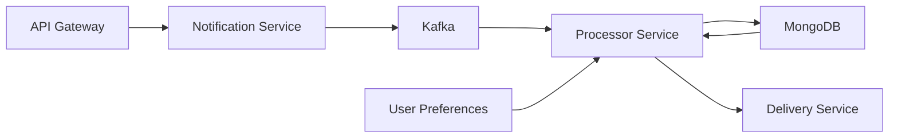
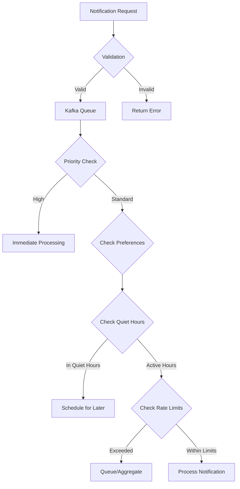

# Distributed Notification System

A scalable, distributed notification system built with TypeScript, Node.js, MongoDB, and Kafka. The system handles real-time notifications, scheduled alerts, and personalized delivery preferences with sophisticated processing logic.

## System Architecture



## Core Features

### 1. Notification Processing

- Real-time and scheduled notification handling
- Priority-based processing (High/Medium/Low)
- Smart throttling and rate limiting
- Quiet hours respect
- Deduplication logic
- Notification aggregation for low-priority alerts

### 2. User Preferences

- Channel-specific preferences (Email/SMS/Push)
- Configurable quiet hours
- Custom notification limits
- Global and per-channel settings

### 3. Advanced Query Features

- **Throttling**: Prevents notification spam based on user limits
- **Quiet Hours**: Respects Do Not Disturb periods
- **Deduplication**: Prevents duplicate notifications within time windows
- **Priority Processing**: Immediate delivery for urgent notifications

## Technical Implementation

### Key Components

1. **Notification Controller**

   - REST API endpoints for notification creation
   - Input validation and sanitization
   - Kafka message publishing

2. **Processor Service**

   - Priority-based routing
   - User preference validation
   - Rate limit checking
   - Quiet hours processing

3. **Data Models**
   - Notification schema with comprehensive tracking
   - User preferences with flexible configuration
   - Delivery attempts logging

### Processing Flow



## Project Structure

```
src/
├── controllers/        # Request handlers
├── services/          # Business logic
├── models/            # Data models
├── interfaces/        # TypeScript interfaces
├── middleware/        # Express middleware
├── utils/            # Helper functions
└── config/           # Configuration files
```

## Getting Started

1. **Prerequisites**

   - Node.js (v14+)
   - MongoDB
   - Kafka
   - TypeScript

2. **Installation**

   ```bash
   npm install
   ```

3. **Development**

   ```bash
   npm run dev
   ```

4. **Build**

   ```bash
   npm run build
   ```

5. **Production**
   ```bash
   npm start
   ```

## API Documentation

The API is fully documented using OpenAPI/Swagger specification. Once the server is running, you can access the interactive API documentation at:

```
http://localhost:3000/docs
```

The Swagger UI provides:
- Detailed endpoint descriptions
- Request/Response schemas
- Try-it-out functionality
- Authentication requirements
- Example requests and responses

Key available endpoints:

### Notifications
- `POST /api/notify` - Create new notification
- `GET /api/notifications` - List notifications with filters
- `GET /api/notifications/:id` - Get notification details
- `DELETE /api/notifications/:id` - Cancel notification

### User Preferences
- `POST /api/preferences` - Update user preferences
- `GET /api/preferences/:userId` - Get user preferences
- `PATCH /api/preferences/:userId` - Update specific preferences

### System
- `GET /health` - System health check
- `GET /metrics` - System metrics (protected)

For detailed API documentation and testing, please refer to the Swagger UI interface.

## Current Status

### Completed Features

- Notification ingestion and validation
- Kafka integration
- User preferences management
- Priority-based processing
- Rate limiting
- Quiet hours processing
- Deduplication logic

### Pending Implementation

- Elasticsearch integration
- Notification aggregation
- Delivery service implementation
- Docker configuration
- Comprehensive testing

## Future Enhancements

1. Enhanced monitoring and metrics
2. Performance optimizations
3. Additional notification channels
4. Advanced aggregation strategies

## Scripts

- `npm run dev`: Start development server
- `npm run build`: Build the project
- `npm start`: Run production server
- `npm run watch`: Watch mode for development
